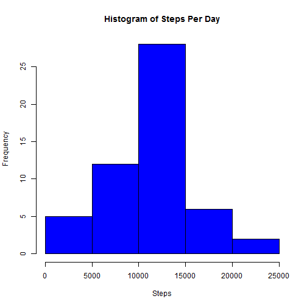
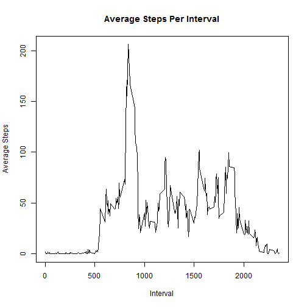
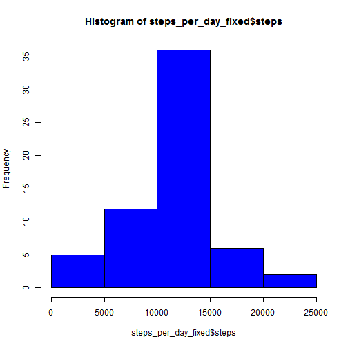
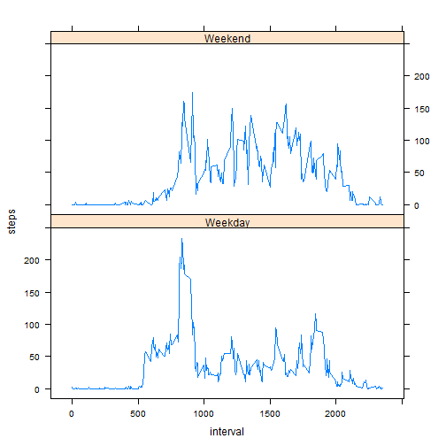

## Load Libraries Needed

```r
library(sqldf)
library(chron)
library(lattice)
```

## Loading and preprocessing the data

```r
step_data_raw <- read.csv('activity.csv')
str(step_data_raw)
```

```
## 'data.frame':	17568 obs. of  3 variables:
##  $ steps   : int  NA NA NA NA NA NA NA NA NA NA ...
##  $ date    : Factor w/ 61 levels "2012-10-01","2012-10-02",..: 1 1 1 1 1 1 1 1 1 1 ...
##  $ interval: int  0 5 10 15 20 25 30 35 40 45 ...
```

## What is mean total number of steps taken per day?

```r
step_data <- sqldf("select steps, date, interval from step_data_raw where steps <> 'NA'")
steps_per_day <- sqldf("select date, sum(steps) as steps from step_data group by date")
hist(steps_per_day$steps, col="blue", main="Histogram of Steps Per Day", xlab="Steps")
```

 

```r
median(steps_per_day$steps)
```

```
## [1] 10765
```

```r
mean(steps_per_day$steps)
```

```
## [1] 10766.19
```


## What is the average daily activity pattern?

```r
step_per_interval_avg <- sqldf("select interval, avg(steps) as avg_steps from step_data_raw group by interval")
with(step_per_interval_avg, plot(interval, avg_steps, type="l", main="Average Steps Per Interval", xlab="Interval", ylab="Average Steps"))
```

 

```r
sqldf("select interval from step_per_interval_avg where avg_steps = (select max(avg_steps) from step_per_interval_avg)")
```

```
##   interval
## 1      835
```

## Imputing missing values

```r
step_data_raw_fixed <- step_data_raw
step_data_raw_fixed[is.na(step_data_raw_fixed)] <- -1
step_data_raw_fixed <- sqldf("select r.date, r.interval, case when r.steps = -1 then a.avg_steps else r.steps end as steps from step_data_raw_fixed r, step_per_interval_avg a where r.interval = a.interval")
steps_per_day_fixed <- sqldf("select date, sum(steps) as steps from step_data_raw_fixed group by date")
hist(steps_per_day_fixed$steps, col="blue")
```

 

```r
median(steps_per_day_fixed$steps)
```

```
## [1] 10766.19
```

```r
mean(steps_per_day_fixed$steps)
```

```
## [1] 10766.19
```

As the average steps for a missing interval are filled in, there is no difference between the graphs that are showing missing data omitted or missing data filled in with average.   

## Are there differences in activity patterns between weekdays and weekends?

```r
step_data_raw$weekend = chron::is.weekend(step_data_raw$date)
step_data_wkday_avg <- sqldf("select interval, avg(steps) as steps  from step_data_raw where weekend = 0 and steps <> 'NA' group by interval")
step_data_wkend_avg <- sqldf("select interval, avg(steps) as steps  from step_data_raw where weekend <> 0 and steps <> 'NA' group by interval")
steps_data_wkday_wkend <- sqldf("select interval, steps, 'Weekday' as day_type from step_data_wkday_avg union select interval, steps, 'Weekend' as day_type from step_data_wkend_avg ")

xyplot(steps ~ interval | day_type, data = steps_data_wkday_wkend, type="l", layout=c(1,2))
```

 
